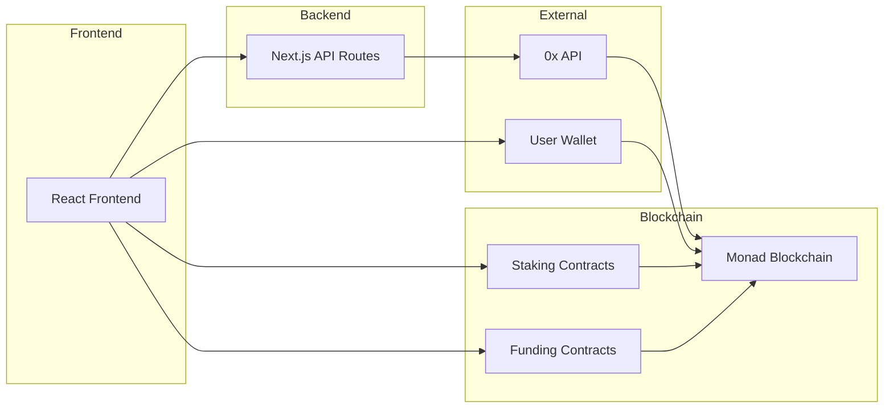
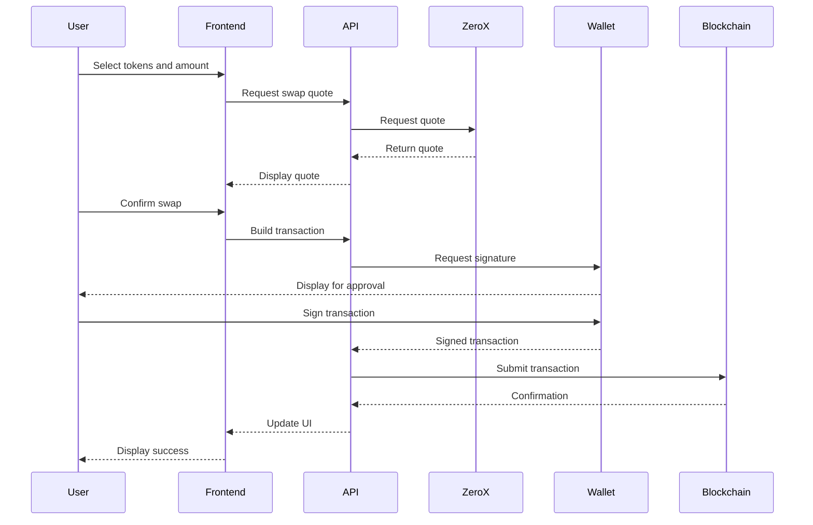
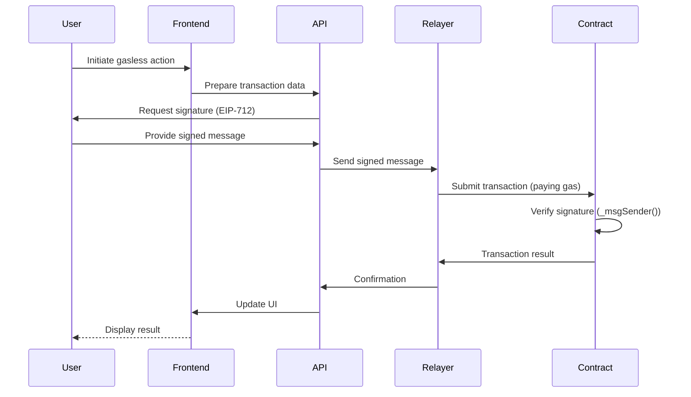

# Rollinad DApp - Technical Documentation

This document provides a comprehensive technical overview of the Rollinad DApp, a decentralized finance (DeFi) platform built on the Monad blockchain (and EVM compatible chains). Rollinad offers staking, token swapping, and a DAO-based funding platform for new projects.


## 1. Introduction

Rollinad DApp provides three core functionalities:

*   **Staking:** Users can stake ERC20 tokens in customizable staking pools to earn rewards, with configurable durations, APY rates, and early withdrawal penalties.
*   **Token Swapping:** Integrated with the 0x Protocol, users can seamlessly swap between various ERC20 tokens and the native token (e.g., MON, ETH). Both standard and gasless (meta-transaction) swaps are supported.
*   **DAO Funding:** A decentralized autonomous organization (DAO) based funding platform where project creators can launch funding proposals. Users can contribute to proposals and receive project-specific tokens. Successful projects are initially listed on a built-in SimpleAMM. *A key planned feature is the integration of Uniswap V3 pools with bonding curves for enhanced liquidity after project funding.*

## 2. System Architecture

The Rollinad DApp consists of three main interacting components:

*   **Frontend:** A React-based web application, built with Vite, providing the user interface. It uses Material UI for components and React Router for navigation.
*   **Backend (API):** Next.js API routes handle data fetching, transaction preparation (including gasless transactions), and integration with external services like 0x Protocol.
*   **Smart Contracts:** Solidity contracts deployed on the blockchain manage the core logic of staking, the DAO funding platform, token creation, and the SimpleAMM.



*System Architecture Diagram*

## 3. Integrated Partners

<div style="display: flex; align-items: center; gap: 10px; margin-bottom: 20px;">
  <a href="https://privy.io/" target="_blank">
    
  </a>
  <a href="https://0x.org/" target="_blank">
    
  </a>
</div>

## 4. Technologies Used
[](https://skillicons.dev)

This section lists the technologies, libraries, and frameworks used.

### 4.1 Core Technologies

| Category          | Technology          | Description                                                                   |
| :---------------- | :------------------ | :---------------------------------------------------------------------------- |
| Languages         | TypeScript, Solidity, JavaScript | Primary programming languages.                                            |
| Build Tools       | Vite, Webpack         | Frontend build tools.                                                        |
| State Management  | React Context API, React Query | Managing application state.                                               |
| Version Control   | Git                 | Code changes and collaboration.                                             |
| CI/CD             | GitHub Actions        | Automating build, testing, and deployment.                                  |
| Infrastructure    | Vercel              | Hosting the frontend and serverless functions.                               |

### 4.2 Frontend

| Category          | Technology              | Description                                              |
| :---------------- | :---------------------- | :------------------------------------------------------- |
| Framework         | React 18                | UI library.                                               |
| Build System      | Vite                    | Build tool and dev server.                               |
| UI Library        | Material UI v5          | React component library.                                 |
| Styling           | Emotion, styled-components | Styling solutions.                                       |
| Form Management   | React Hook Form, Zod   | Form management and validation.                           |
| Routing           | React Router v6         | Navigation.                                              |
| Data Fetching     | TanStack Query (React Query)        | Data fetching and caching.                                  |
| Animation         | Framer Motion           | Animation library.                                       |
| Internationalization | i18next                 | Internationalization.                                    |
| Date & Time       | date-fns                | Date and time manipulation.                              |
| Icons             | Material Icons, custom SVGs | Icons.                                                  |

### 4.3 Web3 Integration

| Category            | Technology             | Description                                                 |
| :------------------ | :--------------------- | :---------------------------------------------------------- |
| Core Libraries      | Wagmi                  | React hooks for Ethereum.                                   |
|                     | Viem                   | Type-safe Ethereum interactions.                            |
|                     | Ethers.js              | Blockchain interactions.                                   |
| Wallet Connection   | RainbowKit             | Wallet connection UI.                                      |
|                     | Privy                  | Social login and wallet management.                         |connection.                                         |
| Protocol Integrations | 0x Protocol API       | Decentralized exchange aggregation.                        |

### 4.4 Smart Contracts

| Category              | Technology              | Description                                                |
| :-------------------- | :---------------------- | :--------------------------------------------------------- |
| Language              | Solidity ^0.8.17         | Smart contract language.                                   |
| Development Framework | Hardhat                 | Development environment.                                   |frameworks.                                         |
| Deployment            | Hardhat deploy scripts  | Deployment scripts.                                        |
| Standards             | ERC20, ERC721           | Ethereum token standards.                                   |
| Security              | OpenZeppelin Contracts | Secure smart contract components.                           |

### 4.5 Backend / API

| Category         | Technology                | Description                                                |
| :--------------- | :------------------------ | :--------------------------------------------------------- |
| Framework        | Next.js API routes          | Serverless functions.                                      |
| Data Validation  | Zod, TypeScript           | Data integrity and type safety.                             |
| Authentication   | JWT, NextAuth.js (Optional) | User authentication (if applicable).                      |
| Integrations     | 0x Protocol               | Swap quotes and transactions.                               |
|                  | Permissionless             | Account abstraction (gasless transactions).                |
|                  | RPC providers             | Connecting to Ethereum.                                    |
### 4.6 DevOps & Quality

| Category        | Technology             | Description                                         |
| --------------- | :---------------------- | :--------------------------------------------------- |
| Linting         | ESLint, Prettier      | Code style and error checking.                       |
| Type Checking   | TypeScript, tsc        | Static type checking.                                |
| Development Utilities | Concurrently      | Running multiple servers.                          |
|                 | dotenv                | Environment variables.                                |hooks.                                          |
| Development Framework | Hardhat                 | Development environment for compiling, testing, and deploying contracts.          |

## 5. External Dependencies

*   **Privy:** ([privy.io](https://privy.io/)) Wallet connection and user management.
*   **0x Protocol:** ([0x.org](https://0x.org/)) Decentralized exchange aggregation.
*   **Uniswap V3:** ([uniswap.org](https://uniswap.org/)) *Planned Integration:* Automated market maker (AMM) for liquidity pools.
*   **Rainbow Kit:** ([rainbowkit.com/](https://rainbowkit.com/)) Connecting wallets to Dapps.
*   **Vercel:** Frontend and serverless function deployment.

## 6. Smart Contract Architecture

### 6.1 Staking Contracts (`contract/staking/`)

*   **`RollinStaking.sol`:** Manages staking pools: creation, staking, unstaking, rewards, and pool management.

    ```mermaid
    graph TD
        A[User selects staking pool] --> B{Pool exists?};
        B -- Yes --> C[User enters stake amount];
        B -- No --> D[Display error];
        C --> E{Sufficient balance?};
        E -- Yes --> F[Request wallet signature];
        E -- No --> G[Display insufficient balance];
        F --> H[User signs transaction];
        H --> I[Send to blockchain];
        I --> J{Transaction successful?};
        J -- Yes --> K[Update pool state];
        J -- No --> L[Display error];
        K --> M[User receives rewards];
    ```
    *Staking Flowchart*

*   **`FeeVault.sol`:** Collects fees (e.g., from early withdrawals). Administrators can withdraw fees.

### 6.2 Funding Contracts (`contract/funding/`)

*   **`DAOFunding.sol`:** Orchestrates the DAO funding platform.
*   **`DAOView.sol`:** Read-only functions for efficient data retrieval.
*   **`core/`:** Core contract logic (reusability, upgradeability).
*   **`interfaces/`:** Interface definitions for contract interactions.
*   **`libraries/`:** Reusable utility libraries.
*   **`managers/`:** Modular components:
      * **`UserManager.sol`:** User registration, creator privileges, KYC/AML (if applicable).

        ```mermaid
        graph TD
            A[User requests registration] --> B{User already registered?};
            B -- Yes --> C[Display error];
            B -- No --> D{KYC/AML Check};
            D -- Pass --> E[Register user];
            D -- Fail --> F[Reject registration];
            E --> G[Grant creator privileges];
        ```

        *UserManager.sol Flowchart*

      * **`ProposalManager.sol`:** Proposal lifecycle management.

        ```mermaid
        graph TD
            A[User initiates proposal] --> B[Frontend validates input];
            B -- Valid --> C[Frontend -> API];
            B -- Invalid --> F[Display error];
            C --> D[API prepares transaction];
            D --> E[API requests signature];
            E --> G[User signs];
            G --> H[API/Relayer submits to blockchain];
            H --> I[Contract creates proposal];
            I --> J[Frontend updates UI];
        ```

        *ProposalManager.sol Flowchart*

      * **`ContributionManager.sol`:** User contributions, token issuance.

        ```mermaid
        graph TD
            A[User selects proposal] --> B[User enters contribution amount];
            B --> C{Proposal is active?};
            C -- Yes --> D{Sufficient funds?};
            C -- No --> E[Display error];
            D -- Yes --> F[Request wallet signature];
            D -- No --> G[Display insufficient balance];
            F --> H[User signs transaction];
            H --> I[Send to blockchain];
            I --> J{Transaction successful?};
            J -- Yes --> K[Update contribution records];
            K --> L[Issue project tokens to user];
            J -- No --> M[Display transaction error];
        ```

        *ContributionManager.sol Flowchart*
    *   **`TradingManager.sol`:** Integrates with `SimpleAMM.sol` and *will integrate with Uniswap V3* (Section 7).
*   **`tokens/`:**
    *   **`DAOToken.sol`:** ERC20 token template for funded projects.
    *   **`SimpleAMM.sol`:** Basic AMM for initial trading *before* Uniswap V3.

## 7. Bonding Curve & Uniswap Integration (Planned Feature)

*This section describes the planned Uniswap V3 integration. This feature is under development.*

Goal: Robust and liquid market for project tokens.

1.  **`DAOToken` Creation:** A new `DAOToken` (ERC20) is minted.
2.  **`SimpleAMM` Initialization:** Trading starts on `SimpleAMM`.
3.  **Uniswap V3 Pool Creation (Future):** `TradingManager.sol` creates a Uniswap V3 pool (calling the Uniswap Contracts) pairing `DAOToken` with a stablecoin/Native Token.
4.  **Initial Liquidity Provisioning (Future):** Funds and `DAOToken` provide initial liquidity, setting the initial price and bonding curve (configurable).
5.  **Bonding Curve Mechanics (Future):** Uniswap V3's concentrated liquidity acts as a bonding curve. Price changes with buys/sells.

## 8. Token Swapping



*Token Swapping Sequence Diagram*

## 9. Gasless Transactions

Gasless transactions are supported via a relayer system:



*Gasless Transaction Sequence Diagram*

1.  **User Selection:** User chooses "gasless" option.
2.  **Transaction Preparation:** Frontend prepares transaction data as a *message*.
3.  **Signature:** User signs an EIP-712 message (no gas cost).
4.  **Relayer Submission:** Signed message is sent to a relayer.
5.  **Signature Verification:** Smart contract verifies the signature.
6.  **Transaction Execution:** Smart contract executes the action.
7.  **Relayer compensation:** (Not detailed here, but the relayer needs compensation).  Uses `_msgSender()` and `Permissionless`.

## 10. Security Considerations

*   **Audits:** Smart contracts *should undergo* independent security audits.
*   **Formal Verification:** Consideration *should be given* to formal verification.
*   **Access Control:** `Ownable` and potentially `Roles` for restricted functions.
*   **Reentrancy Guards:** `ReentrancyGuard` to prevent attacks.
*   **Input Validation:** Rigorous validation on frontend (Zod, React Hook Form) and contracts.
*   **Emergency Pause:** `Pausable` for emergency halting.
*   **Upgradeable Contracts:** Consideration for upgradeable patterns (with risk management).
*   **Rate Limiting:** API rate limiting to prevent DoS.
*   **Safe Math:** OpenZeppelin SafeMath or Solidity >= 0.8.

## 11. Future Enhancements

*   **Cross-Chain Functionality:** Support multiple blockchains.
*   **Advanced Analytics:** More comprehensive analytics.
*   **Governance Features:** On-chain governance.
*   **Customizable Bonding Curves:** Configurable bonding curve parameters.
*   **Liquidity Mining Incentives:** Rewards for providing liquidity.
*   **Uniswap V3 Integration:** *Currently under development.* Complete the integration.

## 12. License
All files are covered by the MIT license, see [`LICENSE`](./LICENSE).